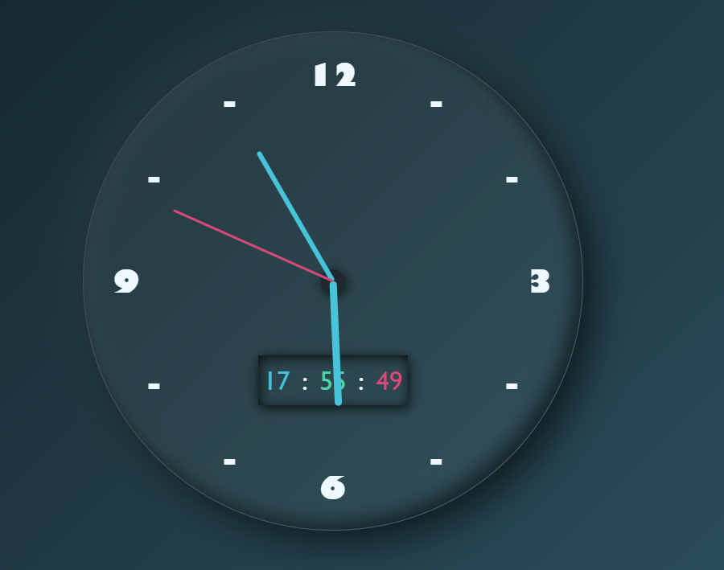

# ⏰ Analog + Digital Clock
A simple Analog + Digital Clock built using HTML, CSS, and JavaScript.

## 🚀 Features
- Real-time analog clock (hour, minute, second hands)
- Digital clock display (HH:MM:SS)
- Clean and modern UI
- Glassmorphism and neumorphism design

## 🛠 Tech Stack
- HTML
- CSS
- JavaScript

## ▶️ How to Run
1. Download or clone the project
2. Open index.html in your browser

## 📸 Preview

## 🙌 Author
Dhrumit Choudhary
